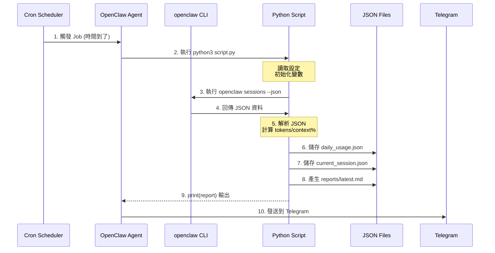
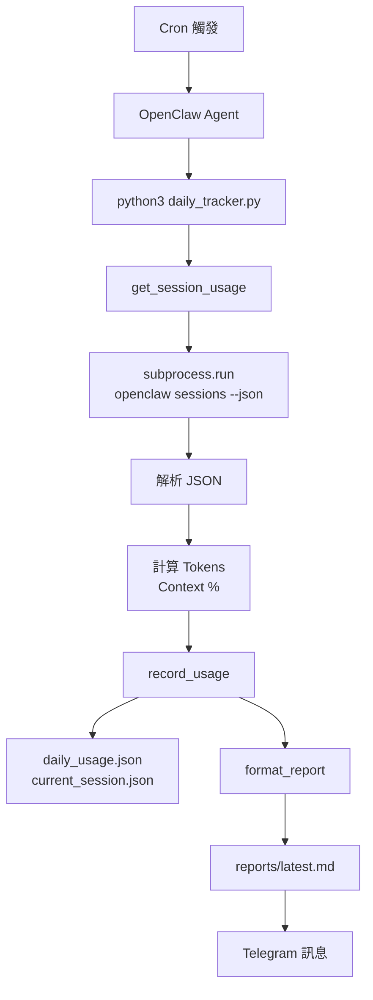

# Cron Job 與 Python 流程詳解

---

## 🔄 Cron Job 執行流程

### Mermaid 流程圖



---

### 資料流向圖



---

## 🐍 Python 腳本結構

### 標準模板

```python
#!/usr/bin/env python3
"""
腳本名稱
功能說明
"""

# ============ 匯入區 ============
import json
import os
import subprocess
from datetime import datetime, timezone, timedelta
from pathlib import Path

# ============ 設定區 ============
# 台北時區
TAIPEI_TZ = timezone(timedelta(hours=8))

# 路徑配置
DATA_DIR = Path(os.environ.get("OPENCLAW_WORKSPACE", "/home/node/.openclaw/workspace"))
OUTPUT_FILE = DATA_DIR / "output.json"

# ============ 函式區 ============

def get_data_from_cli() -> dict:
    """從 CLI 獲取資料
    
    Returns:
        dict: 包含 sessions 列表的資料
    """
    try:
        # 執行外部指令
        result = subprocess.run(
            ["openclaw", "sessions", "--json"],
            capture_output=True,
            text=True,
            timeout=10
        )
        
        # 檢查執行結果
        if result.returncode != 0:
            return {"error": f"CLI error: {result.stderr}"}
        
        # 解析 JSON
        data = json.loads(result.stdout)
        return data
        
    except Exception as e:
        return {"error": str(e)}


def process_data(raw_data: dict) -> dict:
    """處理原始資料
    
    Args:
        raw_data: 從 CLI 獲取的原始資料
        
    Returns:
        dict: 處理後的資料
    """
    processed = {
        "timestamp": datetime.now(TAIPEI_TZ).strftime("%Y-%m-%d %H:%M:%S"),
        "sessions": [],
        "total": 0
    }
    
    # 處理每個 session
    for s in raw_data.get("sessions", []):
        processed["sessions"].append({
            "key": s.get("key"),
            "model": s.get("model"),
            "tokens": s.get("totalTokens", 0)
        })
        processed["total"] += s.get("totalTokens", 0)
    
    return processed


def save_to_json(data: dict, filepath: Path):
    """儲存資料到 JSON 檔案
    
    Args:
        data: 要儲存的資料
        filepath: 檔案路徑
    """
    filepath.parent.mkdir(exist_ok=True)
    with open(filepath, "w", encoding="utf-8") as f:
        json.dump(data, f, ensure_ascii=False, indent=2)


def format_output(data: dict) -> str:
    """格式化輸出訊息
    
    Args:
        data: 處理的資料
        
    Returns:
        str: 格式化後的訊息
    """
    lines = [
        "📊 報告標題",
        f"⏰ {data['timestamp']} (台北)",
        f"📱 Sessions: {len(data['sessions'])}",
        f"🧮 Total: {data['total']:,}"
    ]
    return "\n".join(lines)


# ============ 主程式 ============

if __name__ == "__main__":
    # 腳本直接執行時才會運行這裡
    
    # 1. 獲取資料
    raw_data = get_data_from_cli()
    
    if "error" in raw_data:
        print(f"⚠️ 錯誤: {raw_data['error']}")
        exit(1)
    
    # 2. 處理資料
    processed = process_data(raw_data)
    
    # 3. 儲存檔案
    save_to_json(processed, OUTPUT_FILE)
    
    # 4. 輸出訊息
    print(format_output(processed))
```

---

## 📋 Cron Job 設定範例

### 建立 Cron Job

```python
# 使用 cron tool 建立
job = {
    "name": "My Script Runner",
    "schedule": {
        "kind": "cron",
        "expr": "0 * * * *"  # 每小時執行
    },
    "payload": {
        "kind": "agentTurn",
        "message": "Execute: cd /home/node/.openclaw/workspace && python3 my_script.py",
        "timeoutSeconds": 60
    },
    "delivery": {
        "mode": "announce",
        "channel": "telegram",
        "to": "USER_ID"
    },
    "sessionTarget": "isolated"
}

cron action=add job=job
```

### Cron 時間格式

```
┌──────────── 分鐘 (0-59)
│ ┌────────── 小時 (0-23)
│ │ ┌──────── 日期 (1-31)
│ │ │ ┌────── 月份 (1-12)
│ │ │ │ ┌──── 星期 (0-6, 0=週日)
│ │ │ │ │
* * * * *

範例:
0 9 * * *     每天 09:00
0 1,4,10,13 * * *  01:00, 04:10, 10:00, 13:00
0 9 * * 1-5   週一至週五 09:00
*/15 * * * *  每 15 分鐘
```

---

## 📁 檔案結構範例

```
/home/node/.openclaw/workspace/
├── my_script.py           # 主腳本
├── daily_usage.json       # 每日累積資料
├── current_state.json     # 當前狀態
└── reports/
    ├── latest.md          # 最新報告
    └── report_20260217.md # 歷史報告
```

---

## ⚠️ 常見錯誤處理

```python
def safe_execute():
    """安全的執行範例"""
    try:
        # 嘗試執行
        result = subprocess.run(
            ["command"],
            capture_output=True,
            text=True,
            timeout=30  # 避免卡住
        )
        
        # 檢查回傳碼
        if result.returncode != 0:
            return {"error": f"Failed: {result.stderr}"}
        
        # 檢查輸出
        if not result.stdout:
            return {"error": "Empty output"}
        
        return {"success": True, "data": result.stdout}
        
    except subprocess.TimeoutExpired:
        return {"error": "Timeout"}
    except json.JSONDecodeError as e:
        return {"error": f"Invalid JSON: {e}"}
    except Exception as e:
        return {"error": f"Unknown: {e}"}
```

---

## 🧪 測試腳本

```bash
# 直接執行測試
cd /home/node/.openclaw/workspace
python3 my_script.py

# 檢查輸出
python3 my_script.py > output.txt

# 檢查 JSON 檔案
cat daily_usage.json | python3 -m json.tool

# 監看即時輸出
watch -n 5 python3 my_script.py
```

---

*最後更新: 2026-02-17*
